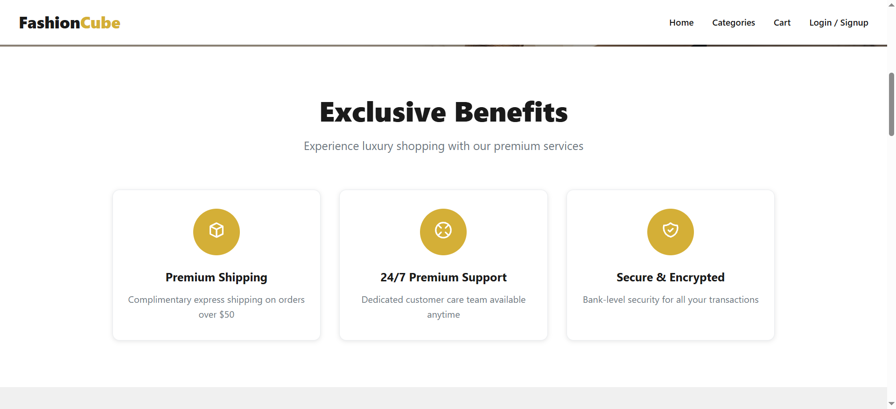
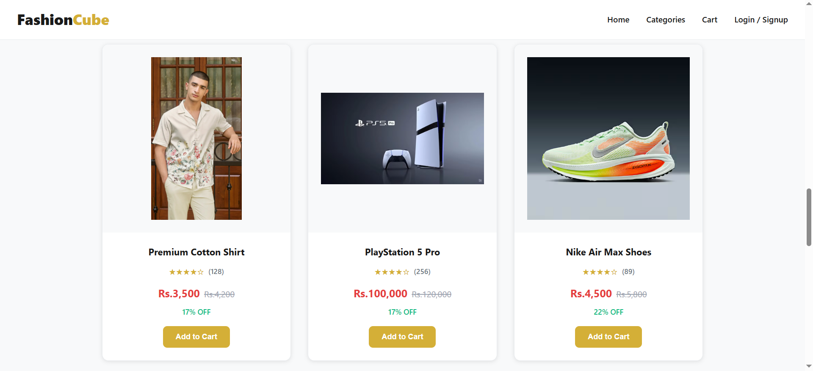

# E-Commerce Platform

A modern, full-stack e-commerce platform built with React and Node.js. This project demonstrates my skills in building scalable web applications with user authentication, shopping cart functionality, and responsive design.

## Screenshots







### Prerequisites
- Node.js (v16 or higher)
- npm or yarn

### Installation

1. **Clone the repository**
   ```bash
   git clone https://github.com/rishabh0078/ecommerce-platform.git
   cd ecommerce-platform
   ```

2. **Install frontend dependencies**
   ```bash npm install```

3. **Install backend dependencies**
   ```bash cd server npm install```

4. **Run the application**
   ```bash
   # Terminal 1 - Start backend server
   cd server
   npm run dev

   # Terminal 2 - Start frontend
   npm run dev ```

The application will be available at `http://localhost:5173`


